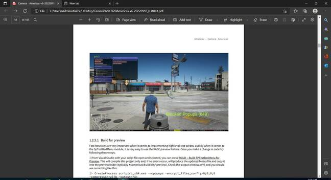

Take-Two Interactive confirmed on Monday that its Rockstar Games subsidiary has been compromised and confidential data for Grand Theft Auto 6 has been stolen.

It also appears at least some of the material was leaked online via a message board.

"Rockstar Games recently experienced a network intrusion in which an unauthorized third party illegally accessed and downloaded confidential information from its systems, including early development footage for the next Grand Theft Auto," the company said in a [September 19](https://www.take2games.com/ir/sec-filings) securities filing. "Current Rockstar Games services are unaffected. We have already taken steps to isolate and contain this incident."

The biz said work on Grand Theft Auto 6 (GTA 6) will continue as planned and that the game's development and release schedule should not be affected.

Rockstar Games issued a similar statement [via Twitter](https://twitter.com/RockstarGames/status/1571849091860029455), expressing disappointment and promising an update on the situation soon.

The hacking incident occurred nine years after the September 17, 2013 release of the previous iteration of the GTA franchise.

On Sunday, an individual claiming without substantiation to have participated in the [recent Uber hack](https://www.theregister.com/2022/09/16/uber_security_incident/) and posting under the screen name "teapotuberhacker" published screenshots of game source code to a discussion thread on gtaforums.com titled "GTA 6 (Americas) leak - 90+ .mp4 footage/videos."

It was speculated online over the weekend that the individual was affiliated with the Lapsus$ gang linked to intrusions at Cisco, Microsoft, and others.

The posts – since altered by moderators – included a screenshot of a Python build script named GTA6.py, a screenshot of GTA5 C++ source code, links to source code copied to paste.ee, and a gofile.io link to download the purloined videos, among other evidence of the compromise.

