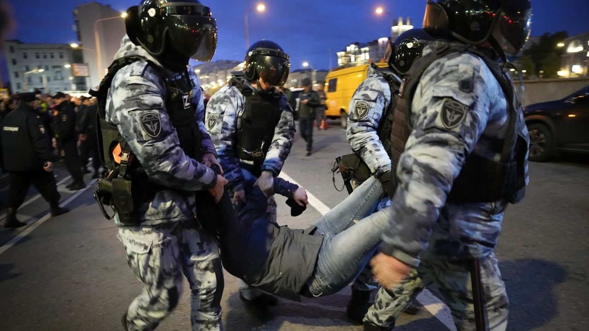

CNN
 — 
More than 1,300 people were detained across Russia on Wednesday for participating in nationwide anti-war protests – with some directly conscripted into the military, according to a monitoring group, after leader Vladimir Putin announced a [“partial mobilization”](https://www.cnn.com/2022/09/21/europe/ukraine-russian-referendums-intl-hnk/index.html, "partial mobilization") of citizens for his [faltering invasion](https://cnn.com/2022/09/19/europe/kupiansk-ukraine-liberated-russia-intl-cmd/index.html) of [Ukraine](https://edition.cnn.com/europe/live-news/russia-ukraine-war-news-09-22-22/).

Images and videos show police cracking down on demonstrators in multiple cities, with footage showing several protesters at a demonstration in central Moscow being carried away by the police and authorities in St. Petersburg attempting to contain a crowd chanting “no mobilization” outside Isakiivskiy Cathedral.

Police detained the protesters across 38 cities in Russia on Wednesday, according to figures released shortly after midnight by independent monitoring group OVD-Info. The group’s spokeswoman Maria Kuznetsova told CNN by phone that at at least four police stations in Moscow, some of the protesters arrested by riot police were being drafted directly into Russia’s military.

One of the detainees has been threatened with prosecution for refusing to be drafted, she said. The government has said that punishment for refusing the draft is now 15 years in jail. Of the more than 1,300 people detained nationwide, more than 500 were in Moscow and more than 520 in St. Petersburg, according to OVD-Info.

Just over half the detained protesters whose names were made public are women, OVD-Info also said, making it the biggest anti-government protest by share of women in recent history. The watchdog specified the full scale of the arrests remains unknown, however.

Nine journalists and 33 minors are also among the detained, it said, adding that one of the minors was “brutally beaten” by law enforcement.

